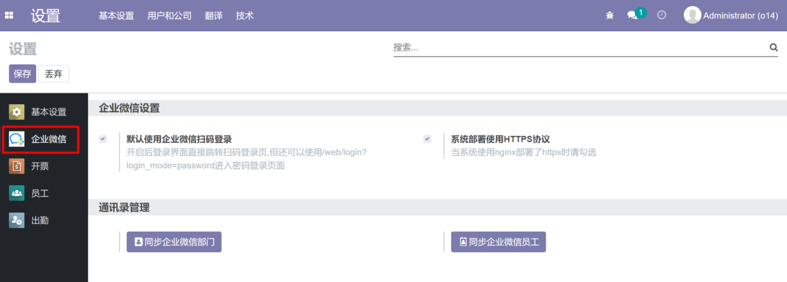
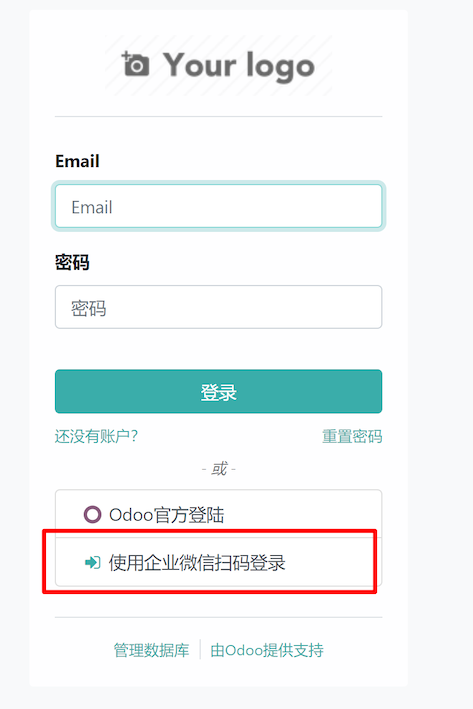
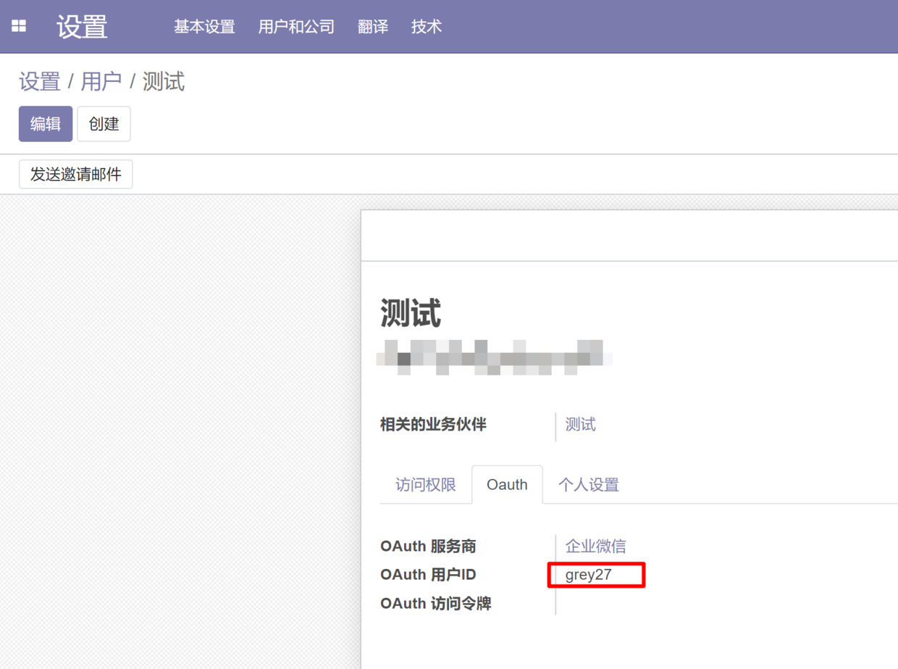
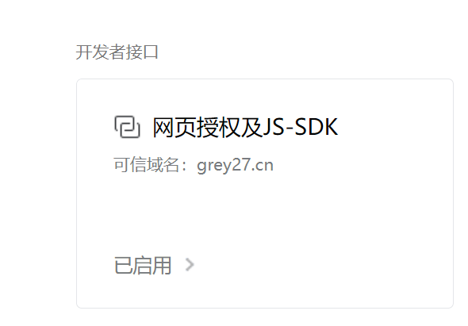
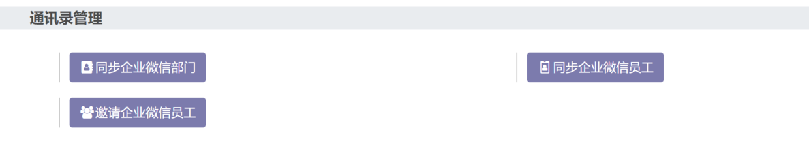
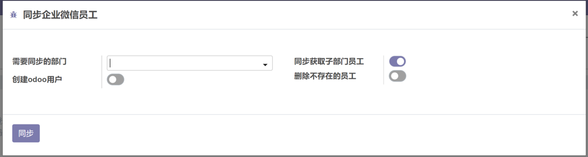
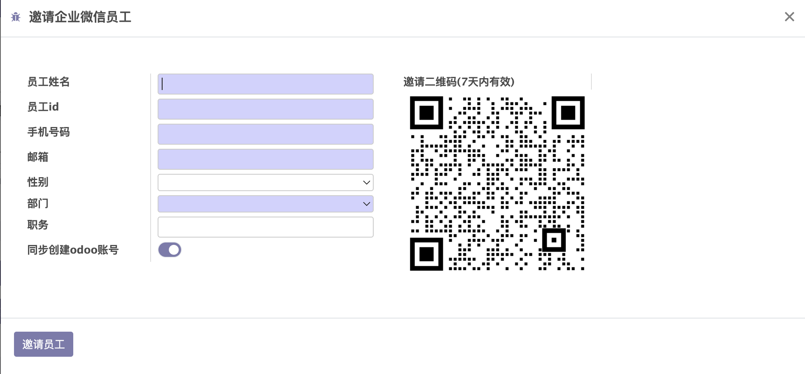
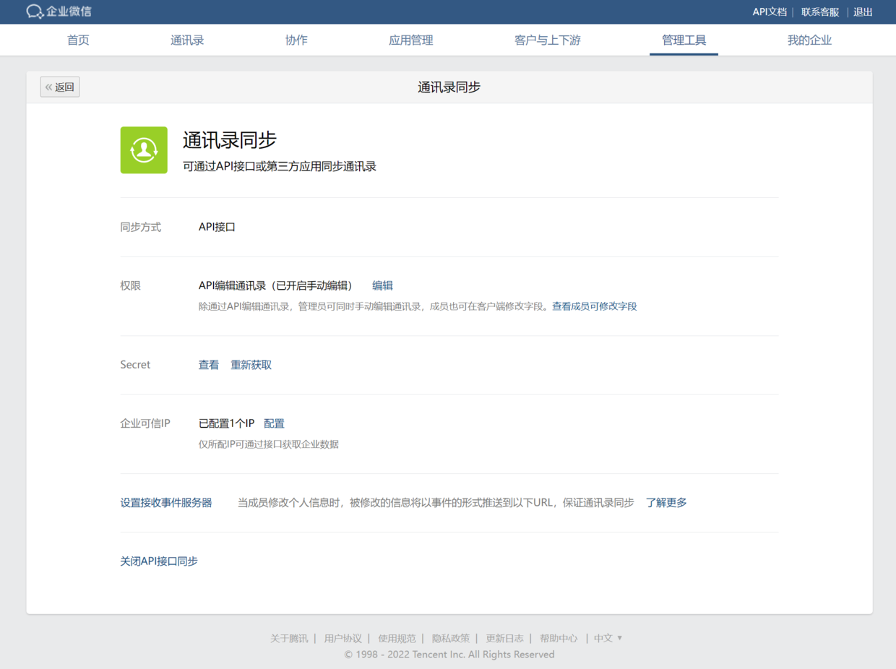
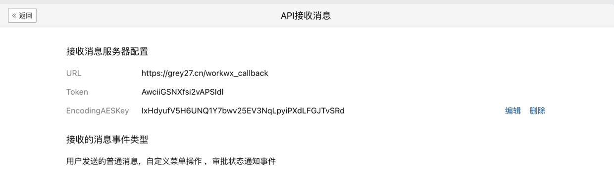
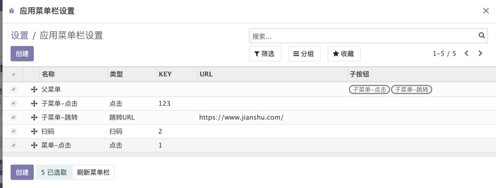

## 免责声明
使用模块导致系统或企业微信数据出现异常,本人概不负责,请自行测试功能是否适合使用
### 配置方法
1.安装模块后,在启动odoo的conf文件中增加参数配置你的企业微信  
参数获取方法请参考官方文档 https://developer.work.weixin.qq.com/document/path/90665  
下面例子仅供参考对应参数大概长什么样,不要照抄!!!  
workwx_corp_id = wwe30a56b2d6f369bc  
workwx_corp_secret = Q1vKIFGaXXQoRLB8fqPNvGlnqAAvNEqZIt1UB2msPtg  
workwx_agent_id = 1000002  
加入配置后需要重启生效,安装模块后可在设置菜单下看到企业微信相关的设置  



### 基础功能
1.企业微信扫码登录  
  
扫码登录的前提是需要odoo的用户需要和企业微信员工关联,然后对应员工扫码后就可以登录这个用户,关联字段为Oauth用户ID 需要填入企业微信员工账号
  
  

2.企业微信内打开odoo链接自动登录/跳转默认浏览器
- 自动登录,企业微信内使用特定链接可以实现自动登录对应员工账号并跳转指定页面,url接口为 /workwx/web?redirect_uri=XXXXXXXX (需要进行url编码) 
例如跳到这个页面```web#action=70&active_id=99&model=res.users&view_type=list&cids=&menu_id=4```  
则自动登录跳转链接为  
```/workwx/web?redirect_uri=web%23action%3D70%26active_id%3D99%26model%3Dres.users%26view_type%3Dlist%26cids%3D%26menu_id%3D4```
- 跳转默认浏览器，企业微信中内置的浏览器内核不同对odoo页面支持不够友好,odoo一般只推荐在谷歌浏览器下使用,所以需要将系统默认浏览器设置为谷歌然后在使用企业微信js-sdk能力在企业微信中点击链接自动跳到系统默认的谷歌浏览器打开odoo页面

使用sdk需要进入企业微信后台应用中授权!  
  
  
如果不希望跳转到系统浏览器的话可以在/workwx/web中增加参数inner=1保持企业微信内打开页面


### 通讯录管理
>因为企微接口变更导致新申请的应用基本无法使用通讯录接口了！！！！  

  


1. 同步企业微信部门
  同步所有企业微信部门至odoo(保持与企业微信完全一致,odoo中多出的部门将被归档)
2. 同步企业微信员工
   

  同步企业微信员工至odoo
  可以配置同步选项:
    - 同步哪个部门下的员工
    - 是否为员工创建odoo用户(用户与企微员工自动关联)
    - 是否归档不存在的员工  

3.邀请企业微信员工
    
使用该功能需要在企业微信后台-管理工具-通讯录同步进行如下设置
1.权限设置为API编辑通讯录
2.查看Secret并写odoo启动文件中 workwx_address_secret = tkGs5OrJqxxxxxLmwI6bo2DtBHxooQhinraoQD9WT8(写入你自己的Secret)
3.配置企业可信IP
  


### 回调配置
后面的多个功能涉及到企业微信回调设置，提前说明一下如何设置回调
进入企业微信管理后台应用界面 ->  接收消息 -> 启用API接收
输入自己对应的域名，接口为 /workwx_callback
   
将对应参数也加入到启动文件中
workwx_callback_token = AwciiGSNXfsi2vAPSIdl
workwx_callback_aeskey = IxHdyufV5H6UNQ1Y7bwv25EV3NqLpyiPXdLFGJTvSRd
配置后重启服务再保存页面，在保存时企微会对该地址进行校验是否回调正常

### 应用管理
1.自定义菜单栏
  
支持三种类型菜单按钮
- 点击 点击后回调对应key的方法
- 跳转 点击后跳转指定url页面
- 扫码 企微调用扫码功能并回调对应key的方法
点击，扫码回调需要设置好回调接口否则无法正常使用